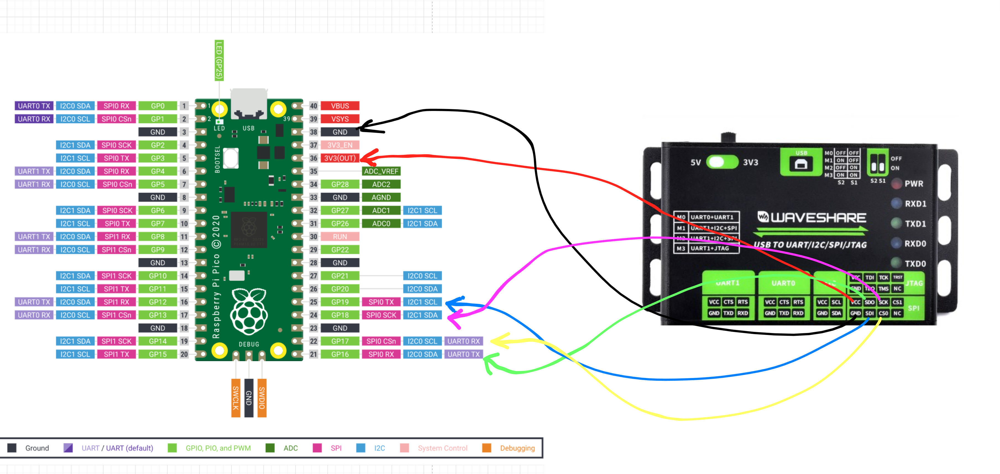

# How to use

## Copy libch347.so to /usr/local/lib

Add to .profile or .bashrc

```bash
export LD_LIBRARY_PATH="/usr/local/lib"
```

Run `source .profile` or `source .bashrc`

Copy libch347.so to /usr/local/lib

```bash
sudo cp lib/libch347.so /usr/local/lib
```

## Run with sudo

`cd target/debug`

`sudo LD_LIBRARY_PATH=$LD_LIBRARY_PATH ./waveshare_usb_to_spi_adapter`

## Rootless mode

#### Create Group

`sudo groupadd ch34x`

#### Apply target user to the group

`sudo usermod -aG ch34x <USER_NAME>`

> note: after this logout and login again

#### Add udev rule

`sudo nano /etc/udev/rules.d/99-ch34x.rules`

```bash
ATTRS{idVendor}=="1a86", ATTRS{idProduct}=="55db", MODE="664", GROUP="ch34x"
```

> note: idVendor and idProduct can be found using `lsusb`

Reload udev rules

```bash
sudo udevadm control --reload-rules
sudo udevadm trigger
```

#### Verify

`ls -l /dev/ch34x_pis6`

## Connection with Raspberry pico



for slave (raspberry pico)

```rust
 let _spi_can_sclk = pins.gpio18.into_function::<hal::gpio::FunctionSpi>();
let _spi_can_mosi = pins.gpio19.into_function::<hal::gpio::FunctionSpi>();
let _spi_can_miso = pins.gpio16.into_function::<hal::gpio::FunctionSpi>();
let mut _spi_can_cs = pins.gpio17.into_push_pull_output();
let spi_can_pin_layout = (_spi_can_mosi, _spi_can_miso, _spi_can_sclk);
let spi0_can = hal::Spi::<_, _, _, 8 >::new(pac.SPI0, spi_can_pin_layout);
let mut spi_can = spi0_can.init_slave(
& mut pac.RESETS,
FrameFormat::MotorolaSpi(MODE_1)
);

//in loop

let mut data: [u8; 4] = [b'\0'; 4];

match spi_can.read( & mut data) {
Ok(d) => {
println ! ("data: {:?}", data);
}
Err(_) => {
println ! ("error");
}
}
```

for master (CH347)

```rust
  let mut CH347_SPI = mSpiCfgS {
iMode: 1,
iClock: 2,
iByteOrder: 1,
iSpiWriteReadInterval: 0,
iSpiOutDefaultData: 0xff,
iChipSelect: 0x00,
CS1Polarity: 0,
CS2Polarity: 0,
iIsAutoDeativeCS: 0,
iActiveDelay: 0,
iDelayDeactive: 0,
};


let mut data_to_send: [u8; 4] = [b'a', b'b', b'c', b'd'];
let io_buffer = data_to_send.as_mut_ptr() as * mut c_void;
let result = CH347SPI_Write(
fd,
true,
0x00,
4,
4,
io_buffer,
);
```

## Read more

[ch347](https://www.waveshare.com/wiki/USB_TO_UART/I2C/SPI/JTAG#SPI_Interface_Usage)
[ch347 manual](https://files.waveshare.com/upload/2/2b/CH347-applicationa-development-manual-en.pdf)